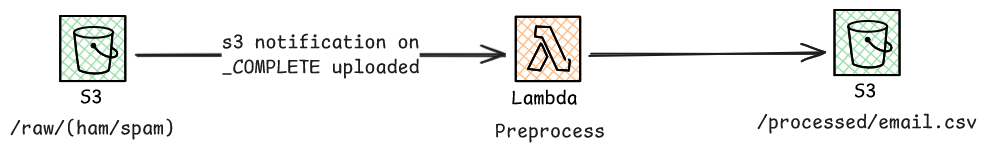

# Spamail – Spam Email Classifier

## Overview
Spamail is a machine learning project that detects **spam vs ham (non‑spam)** emails.  
It takes raw email files, preprocesses them into structured data, trains a classifier, and provides inference scripts for testing and deployment.

---

## Setup

1. **Clone the repo**  
   ```bash
   git clone https://github.com/chawkitariq/spamail.git
   cd spamail
   ```

2. **Create virtual environment**  
   ```bash
   python3 -m venv venv
   source venv/bin/activate
   ```

3. **Install dependencies**  
   ```bash
   pip install -r requirements.txt
   ```

---

## Preprocessing
Run the preprocessing script to convert raw emails into a structured CSV:

```bash
python3 src/preprocess.py
```

This generates:

- `datas/processed/email.csv` → with two columns:
  - `text`: plain text content of the email
  - `label`: `0` = ham, `1` = spam

---

## Training
Train the spam classifier:

```bash
python3 src/train.py
```

This will:
- Load `email.csv`
- Vectorize text using **TF‑IDF**
- Train a **Naive Bayes** (or Logistic Regression) model
- Print evaluation metrics (precision, recall, F1‑score, accuracy)
- Save artifacts in `models/`

---

## Inference
Test the model on sample emails:

```bash
python3 src/inference.py
```

Example output:
```
Email: Congratulations! You have won a free prize, click here to claim.
 → Prediction: SPAM

Email: Hi team, please find the meeting notes attached.
 → Prediction: HAM

Email: Cheap meds available now, limited offer!
 → Prediction: SPAM

Email: Looking forward to our lunch tomorrow.
 → Prediction: SPAM

Email: Get paid to work from home, sign up today!
 → Prediction: SPAM

Email: Don't forget to submit your project report by Friday.
 → Prediction: HAM

Email: Exclusive deal just for you, act fast!
 → Prediction: SPAM

Email: Can we reschedule our appointment to next week?
 → Prediction: HAM
```

---

## AWS Deployment

Deploy the preprocessing pipeline to AWS using Terraform for automated email processing.

### Architecture



### AWS Components

- **S3 Bucket**: Stores raw emails and processed CSV data
- **Lambda Function**: Automatically processes emails when triggered
- **ECR Repository**: Hosts the Lambda container image
- **CloudWatch**: Monitors Lambda execution and logs

### Deploy to AWS

1. **Prerequisites**
   - AWS CLI configured with appropriate permissions
   - Terraform installed
   - Docker installed

2. **Deploy Infrastructure**
   ```bash
   cd terraform
   terraform init \
     -backend-config="bucket=ct-terraform-state-backend" \
     -backend-config="key=spamail-terraform.tfstate" \
     -backend-config="region=eu-west-3"
   terraform plan
   terraform apply
   ```

3. **Upload and Process Emails**
   ```bash
   # Upload ham emails to S3
   aws s3 rsync datas/raw/ham/ s3://dev-spamail-bucket/raw/ham/ --recursive
   
   # Trigger ham processing
   aws s3 cp datas/raw/ham/_COMPLETE s3://dev-spamail-bucket/raw/ham/_COMPLETE
   
   # Upload spam emails to S3
   aws s3 rsync datas/raw/spam/ s3://dev-spamail-bucket/raw/spam/ --recursive
   
   # Trigger spam processing
   aws s3 cp datas/raw/spam/_COMPLETE s3://dev-spamail-bucket/raw/spam/_COMPLETE
   ```

4. **Download Processed Data**
   ```bash
   aws s3 cp s3://dev-spamail-bucket/processed/email.csv datas/processed/
   ```

### How AWS Processing Works

1. **Upload Emails** → Files go to `raw/ham/` or `raw/spam/` in S3
2. **Upload _COMPLETE** → Upload `_COMPLETE` file to trigger Lambda
3. **Lambda Processes** → Processes ALL emails in that folder
4. **CSV Updates** → Appends cleaned emails to `processed/email.csv`

### Clean Up AWS Resources

```bash
cd terraform
terraform destroy
```

---